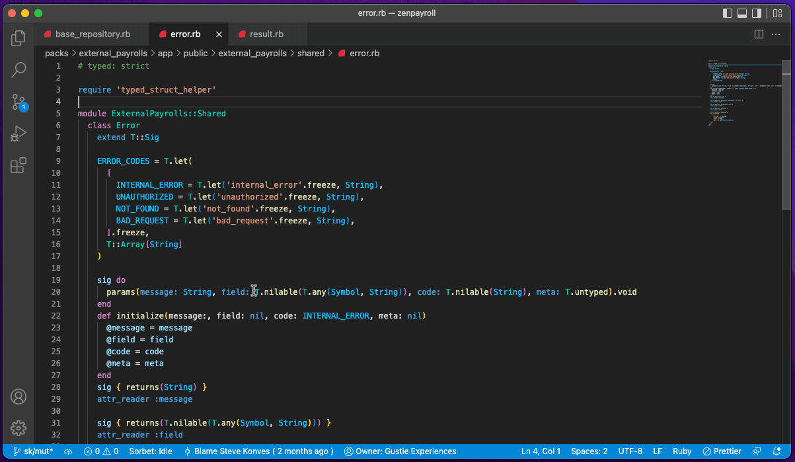

# Code Ownership for VSCode

View code ownership information within your favorite editor!

## Features

View code ownership for every file right in the status bar. You'll get the name of the owning team in the status bar or an alert showing that the file is unowned.

Quick access to the owning team's config file. Clicking on the status bar item will open a popup that includes a button that opens the team's config file. See [Code Teams](https://github.com/rubyatscale/code_teams) for more information on team config files.

## Installation

[Install from Marketplace](https://marketplace.visualstudio.com/items?itemName=Gusto.code-ownership-vscode)

## Requirements

This extension runs the [CodeOwnership](https://github.com/rubyatscale/code_ownership) CLI. You'll need to install and configure [CodeOwnership](https://github.com/rubyatscale/code_ownership) in your repository before using this extension. (Before it's set up, you'll see `Owner: error!` in the status bar.)

## Release Notes

## 0.0.7 - 2022-07-25

- When the ownership status bar item indicates an error, clicking on the status bar item will show the extension's Output Channel.

### 0.0.4 - 2022-05-13

- Initial release

---

Generated with [generator-ts-console](https://www.npmjs.com/package/generator-ts-console) and [generator-code](https://www.npmjs.com/package/generator-code)
